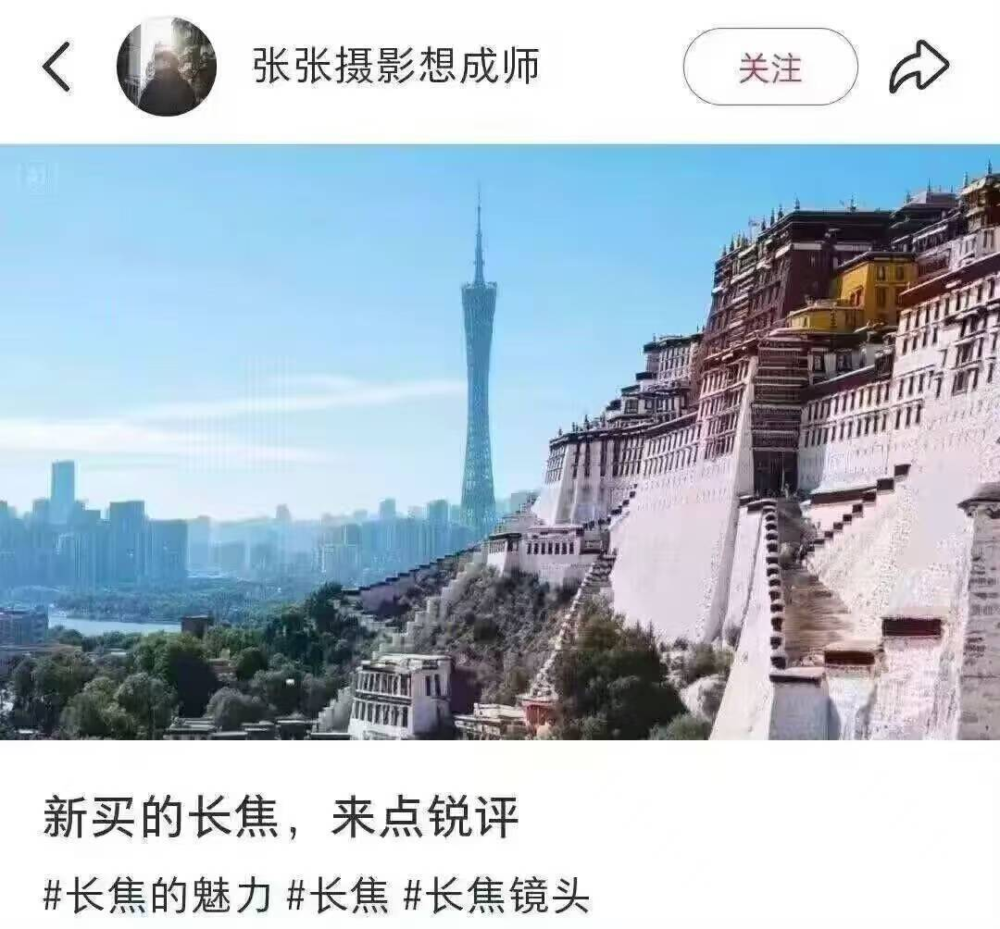
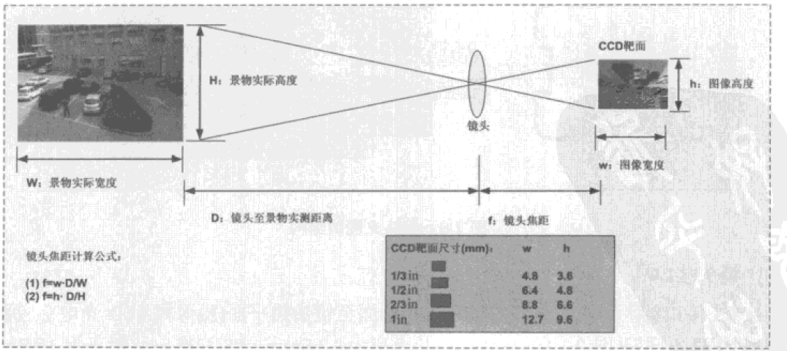
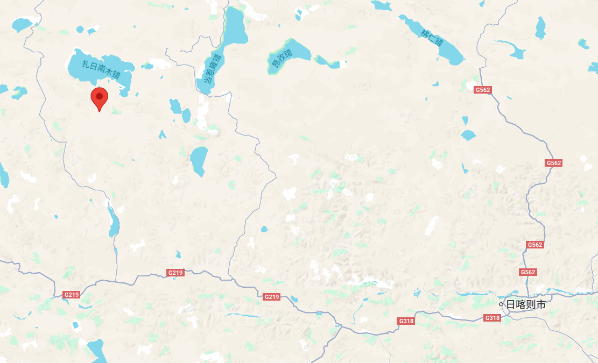
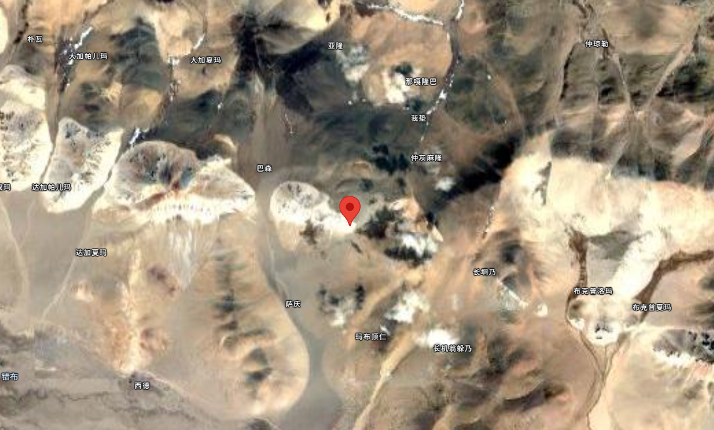

最近看到一张网图：

补充一下，前景是布达拉宫，背景是“小蛮腰”广州塔。两者直线距离将近三千公里。

那确实是很长焦了。

等下？到底有多长焦？👆🤓

---

_声明：下列计算高度来源于chatGPT的o4-mini-high模型，公式适用性未知【_

虽然布达拉宫在图像中已经有明显的透视效果，相当于打一开始就穿帮了（）但我们还是装没看见，草率的估计一下，姑且认为布达拉宫和广州塔在图中的视觉高度相等。

简单的数学，镜头焦距$f=\frac{sD}S$，其中$s$为成像尺寸，$D$为物体到镜头的距离，$S$为物体的实际尺寸。在我们的场景中，广州塔和布达拉宫的建筑高度已知、距离已知，而成像高度相同，即形成方程组：
$$
\begin{cases}
f=\frac{sD_1}{S_1} \\
f=\frac{sD_2}{S_2} \\
D_2 - D_1 = D\\
\end{cases}
$$
其中，布达拉宫建筑的高度$S_1=117.2$米，广州塔的高度$S_2=600$米。布达拉宫的地理坐标为29°39′28″N，91°07′01″E，海拔约3700米；广州塔的地理坐标为23°6′32″N，113°19′8″E，海拔约21米。采用WGS84椭球体，两点转换为ECEF坐标，计算欧氏距离约为2314.57千米，具体来说$D=2 314 565$米。

另外一方面，以佳能EOS R5为例，成像器高度为24mm。测量图片像素，在相同成像器参数下，成像高度约为$s=418/643*24≈15.6$mm。

计算得到$f=s\frac{D}{S_2-S_1}≈4794s≈74787$毫米。也即，74.8米。

74.8米焦距的镜头什么概念？74.8米大约是二十多层楼高，已经不用和长焦单反镜头比了，在天文望远镜领域，智利的VLT-UT极大望远镜的焦距也不过是120米。

在这种距离下，要保证 Airy 斑直径不超过一个像素（避免混叠），需满足
$$
\text{Airy直径} \approx 2.44\,\frac{\lambda\,f}{D} \;\le\;\Delta,
$$
其中

- 焦距 $f=74 787$ mm
- 感光面高度 15.6 mm 对应 418 像素，故像素间距
  $\displaystyle \Delta = \tfrac{15.6}{418}\approx0.0373$ mm
- 取 $\lambda=0.7\,\mu\mathrm m=0.0007$ mm对应最大可见光波段

代入解得
$$
D \;\ge\;2.44\,\frac{\lambda\,f}{\Delta}       =2.44\,\frac{0.0007\times74787}{0.0373}       \approx3426\ \mathrm{mm}       =3.43\ \mathrm{m}.
$$
也就是说，镜头直径要大于3.5米。哥们新买的长焦可能是个天文台。

等下🤓，地面上的天文台能看到这个角度吗？

---

回到刚才的式子，可以得到
$$
d_1 = \frac{DS_1}{S_2-S_1}=\frac{2 314 565\times117.2}{482.8}≈561862.1米 \\
d_2 = d_1 + D =561846.3+2 314 565≈2876427.1米
$$
考虑广州塔中心点、布达拉宫中心点在画面上距离很近，按摄影位置与这两点共线的假设，方向向量$d=P_2-P_1$，则摄影位置$Q=P_2 + 561862.1\hat{\mathbf{d}}$。将$Q$​转换回大地坐标后，Q的位置在北纬 30.636058° （约 30°38′9.81″ N），东经 85.604044° （约 85°36′14.56″ E）。

这是哪？阿里地区措勤县的一个小山包上，看起来能修天文台。

修多高呢？海拔$h=129922米$。

珠穆朗玛峰不到9000米，商用客机常用巡航高度约10668米，气象气球一般在30000米到40000米，最高纪录是53700米，分开大气层与外太空的卡门线在海拔100000米。

在这个高度，你能看到地平线呈现出一条醒目的弧线；大气层只剩下一层薄薄的蓝色光晕，厚度不过几十公里；头顶则是近乎漆黑的宇宙。四周的空间应该很宽敞，因为探空火箭只飞到不到100km的高度，而最低的探测卫星轨道是约167.4km的日本的Tsubame，在头顶上方一段距离外。

那我们还是和天上的太空望远镜比一比吧，如果让詹姆斯韦伯望远镜（JWST）路过的时候拍一张的话，根据[韦伯的参数](https://www.astro.princeton.edu/~jgreene/ast303/NIRCam-pocket-guide.pdf)，如果是成像器大小是韦伯的41.8mm，我们所需的焦距会变为$f≈130268$毫米，而韦伯的焦距是131400毫米。另外，韦伯的口径是6.5米，而我们的需求则是镜头口径需要大于3.43米。~~惊人的相似。~~

再额外考虑一个问题，因为拍摄角度比较低，会穿过很厚的大气层，那么能拍出来这样的图片吗？

Off-Nadir Angle（ONA，天顶角）是卫星（或相机）指向地面目标时，与正下方（nadir）方向的偏离角度。在简化几何中，可用
$$
z = \arctan(\frac{地表水平距离}{相机高度})
$$
近似，带入我们的数据，得天顶角$z=\arctan(\frac{561862}{129922})≈76.98°$。

在平行层大气模型中，空气质量因子可近似表示为$m=\sec z$，得$m=\sec 76.87°≈4.439$。

根据 Beer–Lambert 定律，光在大气中的透过率为$T=\exp(\tau\times m)$，其中$\tau$是垂直方向的大气光学厚度（AOD）。晴朗天气可取$\tau\approx0.1-0.2$，分别带入得
$$
\begin{cases}
T\approx e^{-0.1\times4.439}\approx 0.642, \tau=0.1\\
T\approx e^{-0.2\times4.439}\approx 0.412, \tau=0.2
\end{cases}
$$
意味着透过率仍为41%到64%之间。也就是说，有41%到64%的光子能够到达相机，单从数量上来说，这似乎足够清晰成像了。大气扰动啥的就搞不明白了，姑且算作检验通过。

---

# 开盒结论

图中拍摄位置位于中国西藏自治区阿里地区措勤县（30°38'09.8"N 85°36'14.6"E）上空海拔129922米处。以41.8mm高的成像器为例，拍摄参数为$f=130268\mathrm{mm}$，且镜头口径大于3.43m。

**也就是说，bro新买的必然是韦伯望远镜。**

